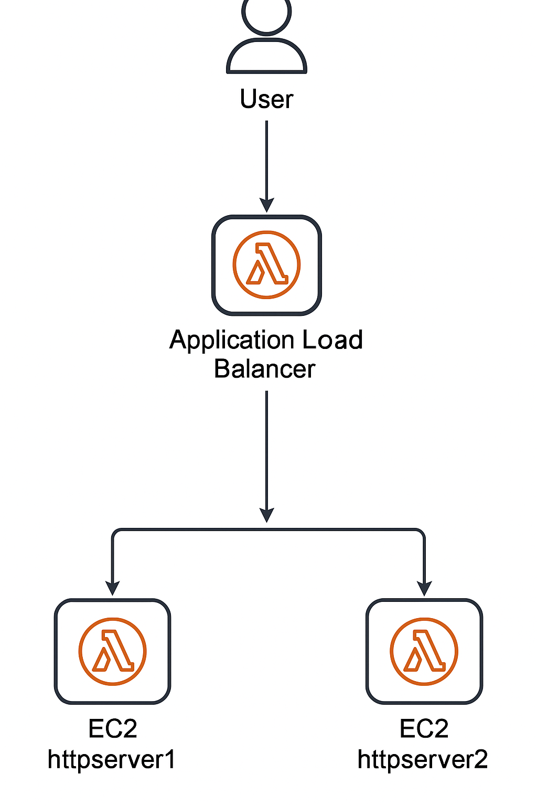

# 🖥️ Project 1: Basic Web App Deployment on AWS EC2 with Load Balancer

This project demonstrates a simple high-availability web application setup using AWS EC2 instances and an Application Load Balancer (ALB).

---

## ✅ Project Overview

- Deployed two EC2 instances using Amazon Linux 2 AMI.
- Installed Apache HTTP server via a Bash script to serve a static web page showing the instance IP.
- Configured a Target Group with health checks.
- Attached both instances to a Load Balancer.
- Verified round-robin load balancing by refreshing the ALB DNS URL.

---

## ⚙️ AWS Services Used

- **EC2 (Elastic Compute Cloud)** – To host the web servers.
- **Security Groups** – To allow HTTP and SSH traffic.
- **Target Groups** – To manage backend instances.
- **Application Load Balancer** – To distribute incoming traffic.
- **Amazon Linux 2 AMI** – As the base operating system.

---

## 🛠️ Setup Steps

### 1. Launch EC2 Instances
- Selected **Amazon Linux 2 AMI**, `t2.micro`.
- Configured **user-data** (bash script) to install `httpd` and create `/var/www/html/index.html`.
- Enabled public IP and opened ports `22 (SSH)` and `80 (HTTP)` in the security group.

### 2. Test EC2 Web Pages
- Visited both instance **public IPs** to verify web pages are served with their own IP addresses.

### 3. Create Target Group
- Type: **Instance**
- Health check path: `/health.html`
- Healthy threshold: `2`
- Registered both EC2 instances.

### 4. Create Application Load Balancer
- Selected **Application Load Balancer**.
- Enabled availability zones: `us-east-1a`, `us-east-1b`.
- Attached previously created **target group**.
- Opened **HTTP (port 80)** in ALB’s security group.

### 5. Verify Load Balancing
- Visited the **ALB DNS name** in browser.
- Observed the IP address switching between the two EC2 instances upon refresh.

### 6. SSH Access
- Connected to instance using PEM key:
  ```bash
  ssh -i your-key.pem ec2-user@<public-ip>


### 📊 Architecture Diagram


