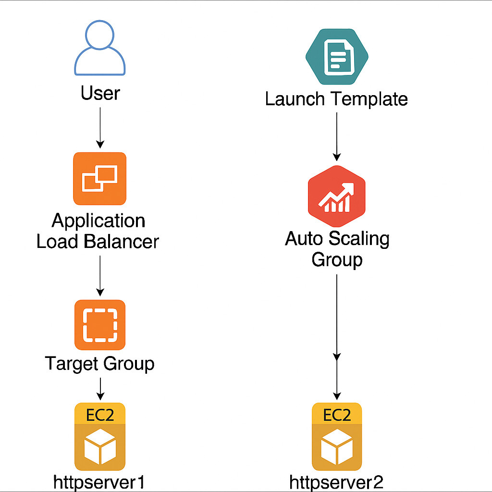

# 🚀 Project 2: Scalable Web Application with EC2, ALB, and Auto Scaling Group (ASG)

This project demonstrates the deployment of a scalable web application on AWS using EC2 instances, an Application Load Balancer (ALB), a Launch Template, and an Auto Scaling Group (ASG).

---

## ✅ Project Overview

- Launched two EC2 instances with Apache web servers and a custom index page.
- Created a **Target Group** and attached both instances.
- Configured an **Application Load Balancer (ALB)** to distribute traffic.
- Created a **Launch Template** to define EC2 instance configuration.
- Set up an **Auto Scaling Group** to ensure availability and scalability.
- Verified scaling and round-robin behavior via ALB DNS.

---

## ⚙️ AWS Services Used

- EC2 (Amazon Linux 2)
- Security Groups
- Target Groups
- Application Load Balancer (ALB)
- Launch Template (LT)
- Auto Scaling Group (ASG)
- Bash scripting (user-data)

---

## 🛠️ Setup Steps

### Part 1: EC2 + ALB Setup
- Launched two EC2 instances (`httpserver1`, `httpserver2`) in different AZs with Apache installed via bash script.
- Created Target Group `web-tg` with health check path `/health.html` and healthy threshold = 2.
- Set up Application Load Balancer `web-lb` across multiple AZs with listener on port 80.

### Part 2: Launch Template
- Created Launch Template `web-lt` using:
  - Amazon Linux 2 AMI
  - t2.micro instance type
  - Existing security group
  - Apache install bash script (via user-data)

### Part 3: Auto Scaling Group
- Created ASG `web-asg` with:
  - Launch Template: `web-lt`
  - Target Group: `web-tg`
  - Desired capacity: 2
  - Scaling Policy: Target tracking (CPU = 80%, Warm-up = 180s)
  - Health check grace period = 180s
  - Tags: Name = `asg-instance`

### Part 4: Validation
- Browsed the **ALB DNS** (e.g., `http://web-lb-xyz.us-east-1.elb.amazonaws.com`)
- Refreshed multiple times to confirm load balancing across instances created by ASG.

### Part 5: Cleanup
- Terminated EC2 instances and deleted ALB, ASG, and other resources from the AWS Console to avoid unnecessary billing.

---

## 📸 Architecture Diagram

> _(Upload your architecture.png here and include it below)_

```markdown

